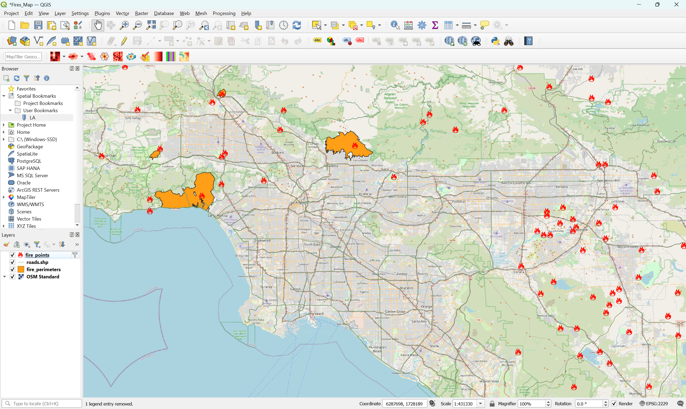
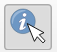
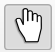
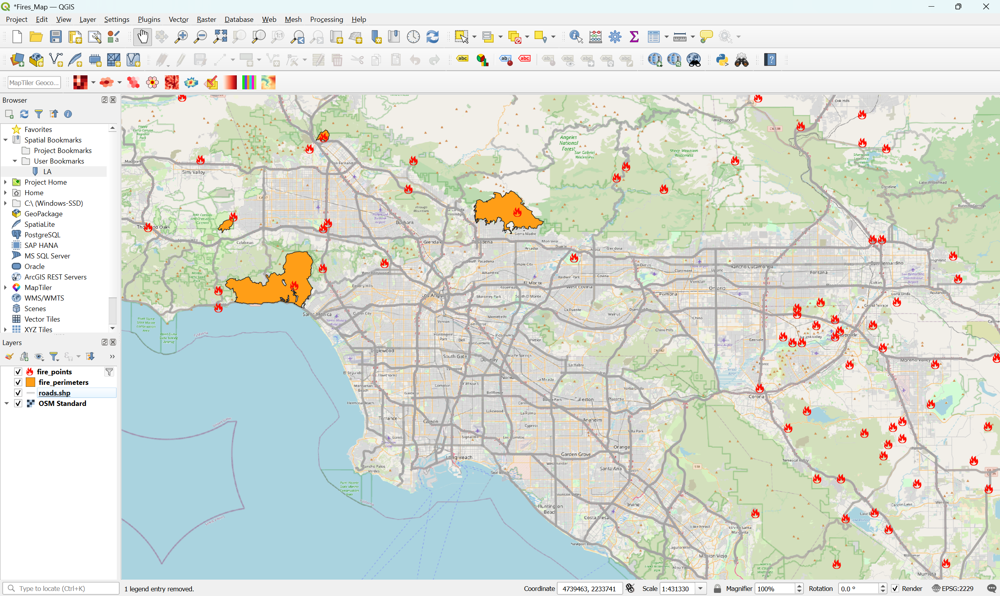
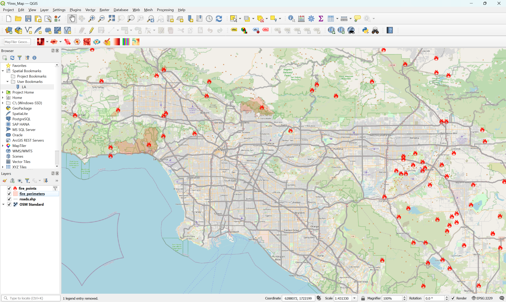

+++
categories = ['activities']
title = 'Vector and Raster Data'
description = 'How to visualize vector and raster data in QGIS'
+++

{}Versión en español{}

## Load the Data

### Download
Click here to download the **fires** folder from Google Drive:
{}Download the Data{}

About the data:
| File Name             | Description     | Source      |
|-----------------------|-----------------|-------------|
| **fire_points** | Points of fires from 1900s to recent | [CAL FIRE](https://www.fire.ca.gov/incidents)
| **roads** | Lines of major roads in California | [US Census Bureau TIGER/Line](https://www.census.gov/geographies/mapping-files/time-series/geo/tiger-line-file.html)
| **fire_perimeters** | Outlines of burned area for 2025 fires | [Wildland Fire Interagency Geospatial Services (WFIGS) Group](https://hub-calfire-forestry.hub.arcgis.com/datasets/CALFIRE-Forestry::wfigs-2025-wildfire-perimeters)
| **satellite_[date]** | Satellite images for three different days of the Palisades Fire: November 28, 2024; January 12, 2025; March 8, 2025 | [Sentinel-2 from the Copernicus Browser](https://browser.dataspace.copernicus.eu/)

## Vector Data
We will visualize fire points, road lines, and burned areas from fires in Los Angeles.

> [!INFO]
> "Vector data" refers to locations, places, or other parts of the Earth's surface that are stored as points, lines, and polygons.

### Add to QGIS
Open a QGIS file and optionally add OpenStreetMap as the basemap and set the coordinate reference system (CRS) to EPSG:2229.

1. Go to Layer > Add Layer > Add Vector Layer...
2. Click the three dots ... next to Vector Dataset(s)
3. Find **fires** folder that you downloaded, go to the **vector** folder, and click and drag to select all 3 files. You can also select the first file, then press Shift while clicking the last file to select all 3
4. Click "Add" and then "Close"
5. The map should look like this, but you may see different colors or a different order


> [!IMPORTANT]
> Remember to save the file by going to Project > Save

### Points
Let's change the points to fire icons and filter to only show fires that have happened in 2024 or 2025.

1. Right click the fire_points layer and left click "Filter..."
2. In the text box below "Provide Specific Filter Expression," paste this: 
```
"incident_date_created" > '2024-01-01'
```
3. Click "OK" and the map will now show fires that have happened after January 1, 2024
4. Right click the fire_points layer and select "Properties"
5. Click on "Symbology" to the left
6. Under "Marker" click on "Simple Marker"
7. Change the "Size" from 2 to 5 to make the points larger
8. Change the "Fill color" to red
9. Next to "Symbol layer type" click where it says "Simple Marker" and change it to "SVG Marker"
10. Scroll to the bottom and type "fire" in the search box under SVG Images
11. Click on one of the fire icons that you like
12. Click "OK"


#### View Information About Fires

1. Click the "Identify Features" icon at the top of QGIS 

2. Left click on the fire_points layer to select it
3. Click on any fire point on the map, and a tab will open with information about that fire. When using the Identify Features tool, you cannot use the mouse to move around the map, you can only click on the points
4. Click the "Pan Map" icon at the top of QGIS to return to the default, so you can click and move around the map again 


> [!TIP]
> The "Identify Features" tool only works on the layer that you have selected (by left clicking on it). For example, we selected the fire_points layer to view more information about each fire point. You can also left click the roads.shp to select it, and then click on any road to show information about it. You can do this for the fire_perimeters layer as well.


### Lines
Let's change the thickness and opacity of the lines.

1. Right click the roads.shp layer and select "Properties"
2. Click on "Symbology" to the left if it is not already selected
3. Change the color to a light gray (or another color you want)
4. Change the opacity to 50.0% (or test other percentages)
5. Change the Width to 1 (or test other widths)
6. Click "OK"
7. (Optional) If you want to change the order of the layers, you can move a layer by clicking and dragging it. For example, you can click the roads.shp layer and, while holding down your mouse, drag it down so that it is below the fire_points and fire_perimeters layers, but above OSM Standard


> [!IMPORTANT]
> Remember to save the file by going to Project > Save

### Polygons
Let's change the color and opacity of the burned areas.

1. Right click the fire_perimeters layer and select "Properties"
2. Click on "Symbology" to the left if it is not already selected
3. Change the color to red (or another color you want)
4. Change the opacity to 20.0% (or test other percentages)
5. Click "OK"



## Raster Data
We will visualize satellite images from Sentinel-2 from before and after the Palisades Fire, a devastating fire that started burning Los Angeles on January 7, 2025.

> [!INFO]
> "Raster data" refers to areas of the Earth's surface that are stored as values on a grid (pixels).

### Add to QGIS

1. Go to Layer > Add Layer > Add Raster Layer...
2. Click the three dots ... next to Raster dataset(s)
3. Find **fires** folder that you downloaded, go to the **raster** folder, and click and drag to select all 3 files. You can also select the first file, then press Shift while clicking the last file to select all 3
4. Click "Add" and then "Close"
5. Move the roads.shp, fire_perimeteres, and fire_points above all 3 satellite layers
6. Optional: Move **satellite_mar25** above the other two satellite layers, **satellite_jan25** below that, and lastly **satellite_nov24**
7. Right click the first satellite layer (**satellite_mar25**) and click the first option, "Zoom to Layer(s)"
8. The map should look like below


### Explore Before and After the Fire
9. Click the check box next to the fire_perimeters to make the layer invisible. This makes it easier to see the satellite image
10. Click the check box next to **satellite_mar25** to compare it with the satellite image from January 2025 when the Palisades fire was actively burning. You can click the check box multiple times to turn it off and on again to compare how the land looked between January and March
11. Make the **satellite_mar25** layer invisible by unchecking it again if needed. Now, only **satellite_jan25** and **satellite_nov24** should be checked
12. Click the check box next to **satellite_jan25** to compare it with the satellite image from November 2024 before the Palisades fire started burning. Like before, you can click the check box multiple times to turn it off and on again to compare how the land looked

> [!note]- Can you spot any other fires besides the Palisades fires?
> The Kenneth Fire (extinguished January 12, 2025 and burned 1000+ acres) is to the top left of the image, and the Woodley Fire (January 8, 2025; burned 30 acres) is to the top right of the image.
