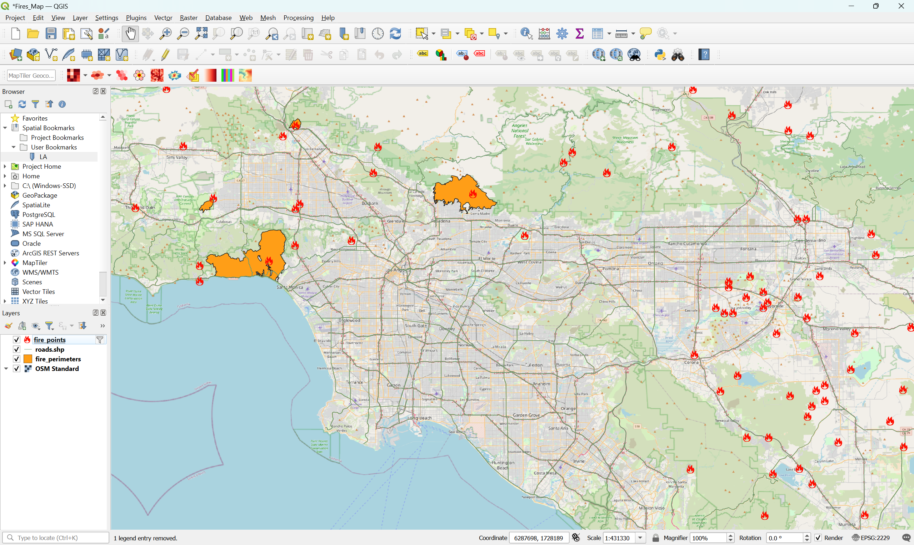
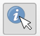
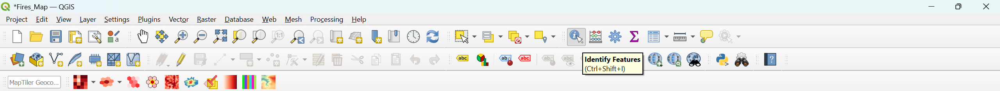
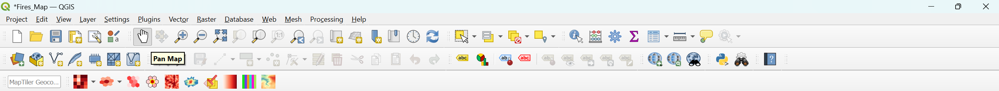
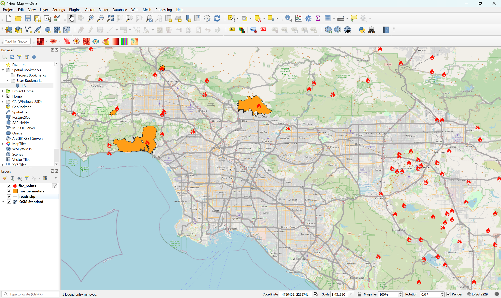
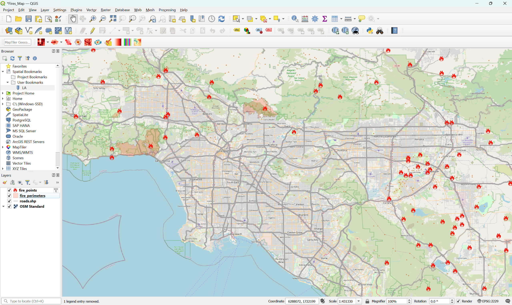

+++
categories = ['activities']
title = 'Datos vectoriales y rasterizados'
description = 'Cómo visualizar datos vectoriales y ráster en QGIS'
+++

## Cargar los datos

### Descargar
Haga clic aquí para descargar la carpeta **fires** de Google Drive:
{}Descargar los datos{}

Acerca de los datos:
| Nombre del archivo | Descripción | Fuente |
|-----------------------|-----------------|-------------|
| **puntos_de_incendios** | Puntos de incendios desde 1900 hasta los más recientes | [CAL FIRE](https://www.fire.ca.gov/incidents)
| **roads** | Líneas de las principales carreteras de California | [US Census Bureau TIGER/Line](https://www.census.gov/geographies/mapping-files/time-series/geo/tiger-line-file.html)
| **fire_perimeters** | Líneas de la zona quemada para 2025 incendios | [Wildland Fire Interagency Geospatial Services (WFIGS) Group](https://hub-calfire-forestry.hub.arcgis.com/datasets/CALFIRE-Forestry::wfigs-2025-wildfire-perimeters)
| **satellite_[date]** | Imágenes de satélite de tres días diferentes del incendio de Palisades: 28 de noviembre de 2024; 12 de enero de 2025; 8 de marzo de 2025 | [Sentinel-2 del Navegador Copernicus](https://browser.dataspace.copernicus.eu/)

## Datos Vectoriales
Vamos a visualizar puntos de fuego, líneas de carreteras y áreas quemadas de incendios en Los Ángeles.

> [!INFO]
> «Datos vectoriales» se refiere a localizaciones, lugares u otras partes de la superficie terrestre que se almacenan como puntos, líneas y polígonos.

### Añadir a QGIS
Abre un archivo QGIS y, opcionalmente, añade OpenStreetMap como mapa base y establece el sistema de referencia de coordenadas (CRS) en EPSG:2229.

1. Vaya a Capa > Añadir capa > Añadir capa vectorial....
2. Haga clic en los tres puntos ... junto a Conjunto(s) de datos vectoriales
3. Busque la carpeta **fires** que ha descargado, vaya a la carpeta **vector** y haga clic y arrastre para seleccionar los 3 archivos. También puede seleccionar el primer archivo y, a continuación, pulse Mayús mientras hace clic en el último archivo para seleccionar los 3
4. Haga clic en «Añadir» y luego en «Cerrar»
5. El mapa debe tener este aspecto, pero es posible que vea diferentes colores o un orden diferente


> [!IMPORTANT]
> Recuerde guardar el archivo en Proyecto > Guardar.

### Puntos
Cambiemos los puntos por iconos de incendios y filtremos para que sólo aparezcan los incendios ocurridos en 2024 o 2025.

1. Haga clic derecho en la capa fire_points y clic izquierdo en «Filtrar...»
2. En el cuadro de texto situado debajo de «Proporcionar expresión de filtro específica», pegue lo siguiente: 
```
"incident_date_created" > '2024-01-01'
```
3. Haga clic en «Aceptar» y el mapa mostrará los incendios ocurridos después del 1 de enero de 2024.
4. Haga clic con el botón derecho del ratón en la capa fire_points y seleccione «Propiedades»
5. Haga clic en «Simbología» a la izquierda
6. En «Marcador» haga clic en «Marcador simple»
7. Cambia el «Tamaño» de 2 a 5 para que los puntos sean más grandes
8. Cambia el «Color de relleno» a rojo
9. Al lado de «Tipo de capa del símbolo» haz clic donde dice «Marcador simple» y cámbialo a «Marcador SVG»
10. Desplácese hasta la parte inferior y escriba «fuego» en el cuadro de búsqueda en Imágenes SVG
11. Haga clic en uno de los iconos de fuego que más te gusten
12. Haga clic en «Aceptar»


#### Ver información sobre incendios

1. Haga clic en el icono «Identificar objetos espaciales» en la parte superior de QGIS 

2. Haga clic izquierdo en la capa fire_points para seleccionarla
3. Haga clic en cualquier punto de incendio del mapa y se abrirá una pestaña con información sobre ese incendio. Cuando se utiliza la herramienta Identificar objetos espaciales, no se puede utilizar el ratón para moverse por el mapa, sólo se puede hacer clic en los puntos
4. Haga clic en el icono «Pan Map» en la parte superior de QGIS para volver a la configuración por defecto, para que pueda hacer clic y moverse por el mapa de nuevo 


> [!TIP]
> La herramienta «Identificar objetos espaciales» sólo funciona en la capa que haya seleccionado (haciendo clic con el botón izquierdo del ratón sobre ella). Por ejemplo, hemos seleccionado la capa fire_points para ver más información sobre cada punto de incendio. También puede hacer clic con el botón izquierdo del ratón en roads.shp para seleccionarla y, a continuación, hacer clic en cualquier carretera para mostrar información sobre ella. También puede hacer lo mismo con la capa fire_perimeters.

### Líneas
Cambiemos el grosor y la opacidad de las líneas.

1. Haga clic con el botón derecho del ratón en la capa roads.shp y seleccione «Propiedades».
2. Haga clic en «Simbología» a la izquierda si no está ya seleccionada
3. Cambie el color a un gris claro (u otro color que desee)
4. Cambia la opacidad al 50.0% (o prueba otros porcentajes)
5. Cambia el Ancho a 1 (o prueba otros anchos)
6. Haga clic en «Aceptar».
7. (Opcional) Si quieres cambiar el orden de las capas, puedes mover una capa haciendo clic en ella y arrastrándola. Por ejemplo, puede hacer clic en la capa roads.shp y, manteniendo pulsado el ratón, arrastrarla hacia abajo para que quede por debajo de las capas fire_points y fire_perimeters, pero por encima de OSM Standard


> [!IMPORTANT]
> Recuerda guardar el archivo en Proyecto > Guardar.

### Polígonos
Cambiemos el color y la opacidad de las áreas quemadas.

1. Haga clic con el botón derecho en la capa fire_perimeters y seleccione «Propiedades»
2. Haga clic en «Simbología» a la izquierda si no está ya seleccionada
3. Cambie el color a rojo (u otro color que desee)
4. Cambia la opacidad al 20.0% (o prueba otros porcentajes)
5. Haga clic en «Aceptar»


## Datos rasterizados
Vamos a visualizar imágenes de satélite de Sentinel-2 de antes y después del incendio de Palisades, un devastador incendio que comenzó a quemar Los Ángeles el 7 de enero de 2025.

> [!INFO]
> Los «datos ráster» se refieren a áreas de la superficie terrestre que se almacenan como valores en una cuadrícula (píxeles).

### Añadir a QGIS

1. Vaya a Capa > Añadir capa > Añadir capa ráster....
2. Haga clic en los tres puntos ... junto a Conjunto(s) de datos ráster
3. Busque la carpeta **fires** que ha descargado, vaya a la carpeta **raster** y haga clic y arrastre para seleccionar los 3 archivos. También puede seleccionar el primer archivo y, a continuación, pulse Mayús mientras hace clic en el último archivo para seleccionar los 3
4. Haga clic en «Añadir» y luego en «Cerrar»
5. Mueva el roads.shp, fire_perimeteres, y fire_points por encima de las 3 capas de satélite
6. Opcional: Mueve **satellite_mar25** por encima de las otras dos capas de satélite, **satellite_jan25** por debajo y, por último, **satellite_nov24**.
7. Haga clic con el botón derecho del ratón en la primera capa de satélite (**satellite_mar25**) y haz clic en la primera opción, «Zoom a la capa(s)»
8. El mapa debería tener el siguiente aspecto


### Explorar antes y después del incendio.
9. Haga clic en la casilla situada junto a fire_perimeters para hacer invisible la capa. Esto facilita la visualización de la imagen de satélite
10. Haga clic en la casilla junto a **satellite_mar25** para compararla con la imagen de satélite de enero de 2025, cuando el incendio de Palisades estaba activo. Puede hacer clic en la casilla de verificación varias veces para desactivarla y activarla de nuevo para comparar cómo se veía la tierra entre enero y marzo
11. Haz invisible la capa **satellite_mar25** desmarcándola de nuevo si es necesario. Ahora, sólo **satellite_jan25** y **satellite_nov24** deben estar marcadas
12. Haga clic en la casilla junto a **satellite_jan25** para compararla con la imagen de satélite de noviembre de 2024 antes de que el incendio de Palisades comenzara a arder. Como antes, puedes hacer clic en la casilla de verificación varias veces para apagarla y encenderla de nuevo para comparar cómo se veía el terreno

> [!note]- ¿Puedes detectar otros incendios además de los de Palisades?
> El incendio de Kenneth (extinguido el 12 de enero de 2025 y que quemó más de 1000 acres) está en la parte superior izquierda de la imagen, y el incendio de Woodley (8 de enero de 2025; quemó 30 acres) está en la parte superior derecha de la imagen.